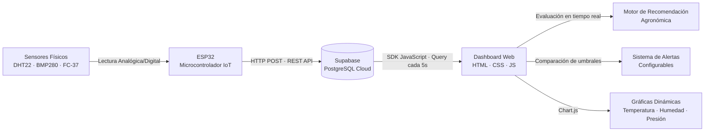
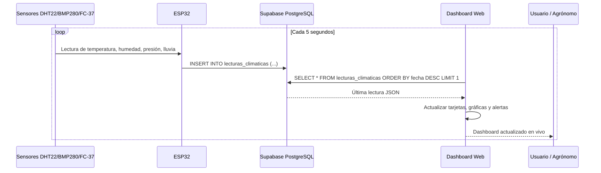
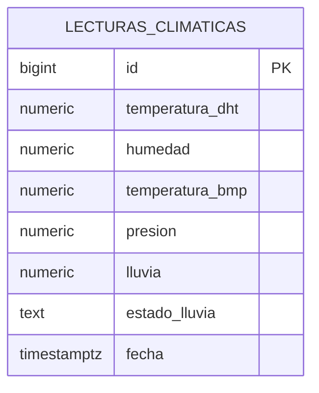
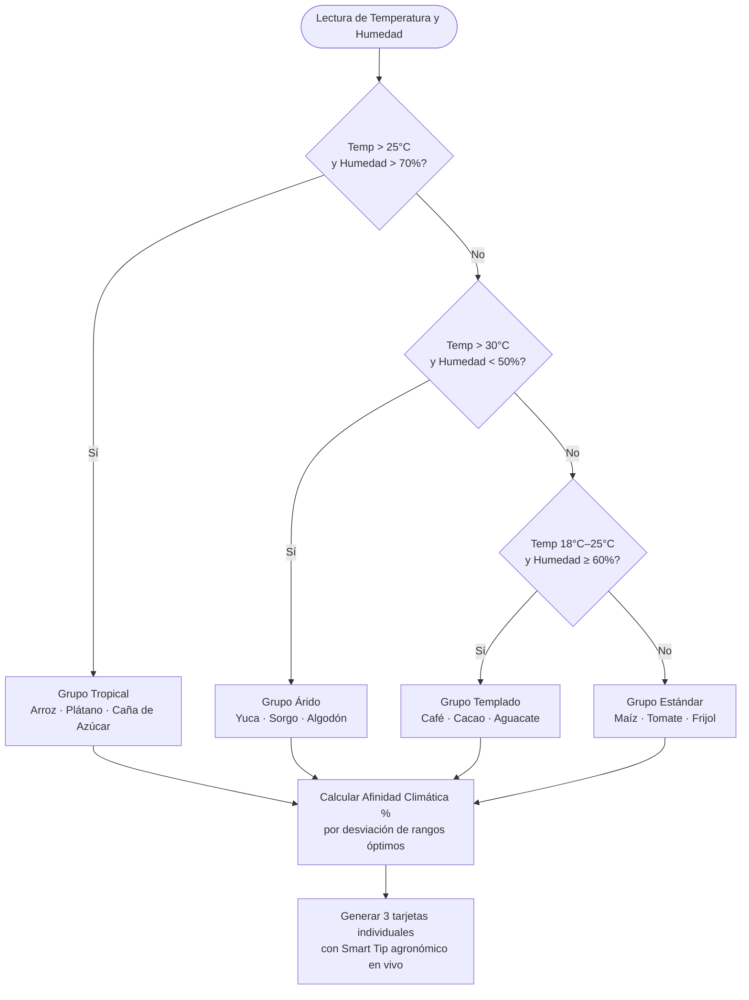
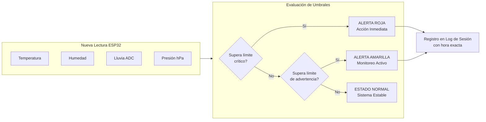
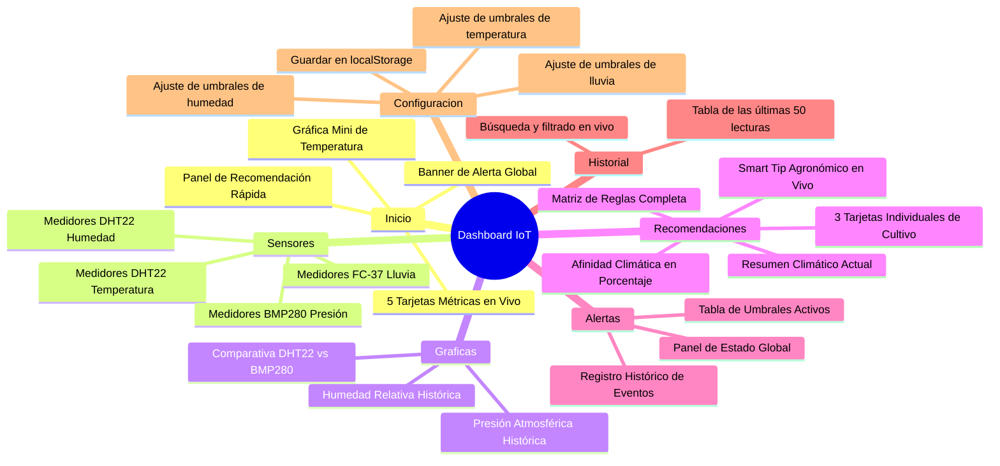

# Sistema IoT de Monitoreo Climático con Recomendación Inteligente de Cultivos


> **Materia:** Internet de las Cosas — Ingeniería en Sistemas  
> **Tipo:** Proyecto Universitario de Producción Real  
> **Estado:** Activo y conectado a base de datos en vivo

Plataforma web de agricultura de precisión que recibe datos climáticos en tiempo real desde un microcontrolador **ESP32**, los almacena en **Supabase (PostgreSQL)** y los visualiza en un dashboard interactivo con motor de recomendación agronómica inteligente, alertas automáticas configurables y análisis gráfico histórico.

---

## Arquitectura General del Sistema



---

## Flujo de Datos en Tiempo Real



---

## Sensores del Sistema

| Sensor | Variable Medida | Pin ESP32 | Protocolo | Precisión |
|--------|----------------|-----------|-----------|-----------|
| **DHT22** | Temperatura Aérea y Humedad Relativa | GPIO14 | Single-Wire Digital | ±0.5°C / ±2% HR |
| **BMP280** | Temperatura de Precisión y Presión Atmosférica | I2C (SDA/SCL) | I2C | ±0.12 hPa |
| **FC-37** | Nivel de Precipitación / Lluvia | ADC A0 | Analógico (0–4095) | Resistivo |

### Interpretación del Sensor de Lluvia FC-37

El sensor FC-37 entrega un valor analógico entre 0 y 4095 unidades ADC. A mayor cantidad de agua sobre la placa, menor es la resistencia eléctrica y por tanto menor el valor leído:

```
4095 ADC ─────── Completamente Seco (Sin lluvia)
3000 ADC ─────── Inicio de Humedad  (Llovizna)
1500 ADC ─────── Lluvia Moderada    (Alerta Amarilla)
 800 ADC ─────── Lluvia Fuerte      (Alerta Roja)
   0 ADC ─────── Saturado Completo  (Tormenta)
```

---

## Estructura de la Base de Datos

La tabla principal almacena cada lectura periódica enviada por el ESP32:



**Descripción de campos:**
- `temperatura_dht` — Temperatura aérea en °C (sensor DHT22)
- `humedad` — Humedad relativa ambiental en % (sensor DHT22)
- `temperatura_bmp` — Temperatura de alta precisión en °C (sensor BMP280)
- `presion` — Presión atmosférica en hectopascales hPa (sensor BMP280)
- `lluvia` — Valor analógico ADC del sensor de lluvia FC-37 (0–4095)
- `estado_lluvia` — Clasificación textual: `Sin lluvia`, `Llovizna`, `Lluvia Fuerte`, `Tormenta`
- `fecha` — Marca de tiempo UTC automática de Supabase

---

## Motor de Recomendación Inteligente de Cultivos

El sistema evalúa las condiciones climáticas actuales mediante un conjunto de reglas agrometeorólogicas y genera automáticamente tres tarjetas de cultivo individuales con información técnica de compatibilidad.

### Árbol de Decisión Agronómica



### Cálculo de Afinidad Climática

Para cada cultivo se calcula un porcentaje de compatibilidad dinámico basado en la desviación absoluta entre la lectura real del sensor y el rango ideal de la planta:

```
Desviación Térmica   = max(0, T_actual - T_max) + max(0, T_min - T_actual)
Desviación Hídrica   = max(0, H_actual - H_max) + max(0, H_min - H_actual)

Afinidad (%) = 100 - (Desviación Térmica × 4 + Desviación Hídrica × 2)
Afinidad (%) = Limitada entre 55% y 99%
```

### Rangos Óptimos de Cultivos

| Cultivo | Temperatura Ideal | Humedad Ideal | Demanda Hídrica | Riego Recomendado |
|---------|-------------------|---------------|-----------------|-------------------|
| Arroz | 25°C – 35°C | 70% – 90% | Muy Alta | Inundación Controlada |
| Plátano | 26°C – 32°C | 75% – 85% | Alta | Frecuente / Aspersión |
| Caña de Azúcar | 25°C – 38°C | 70% – 80% | Alta | Por Gravedad |
| Yuca | 25°C – 35°C | 40% – 60% | Escasa | Goteo Espaciado |
| Sorgo | 28°C – 35°C | 30% – 50% | Escasa | Mínimo / Goteo |
| Algodón | 25°C – 35°C | 40% – 50% | Escasa | Controlado por Déficit |
| Café | 18°C – 22°C | 60% – 80% | Moderada | Moderado Regular |
| Cacao | 20°C – 25°C | 70% – 80% | Moderada-Alta | Regular Sombreado |
| Aguacate | 18°C – 24°C | 60% – 75% | Moderada | Goteo Localizado |
| Maíz | 18°C – 26°C | 50% – 70% | Moderada | Regular por Surcos |
| Tomate | 18°C – 25°C | 50% – 65% | Moderada | Goteo Diario |
| Frijol | 18°C – 24°C | 50% – 70% | Moderada | Bajo a Demanda |

---

## Sistema de Alertas Automáticas

El sistema evalúa cada 5 segundos si las lecturas de los sensores superan los límites de seguridad configurados por el usuario. Las alertas se muestran en tiempo real en el banner superior del dashboard.



### Umbrales de Alerta Predeterminados

| Variable | Normal (Verde) | Advertencia (Amarillo) | Crítico (Rojo) |
|----------|---------------|------------------------|----------------|
| Temperatura DHT | 17.9°C – 28.1°C | 28.1°C – 38°C ó < 17.9°C | > 38°C ó < 5°C |
| Humedad Relativa | 50% – 85% | 85% – 95% ó < 50% | > 95% ó < 20% |
| Lluvia (ADC) | > 3000 | 1500 – 3000 | < 1500 |
| Presión Atmosférica | 995 – 1020 hPa | 985–995 ó 1020–1040 hPa | < 985 ó > 1040 hPa |

> Los umbrales son completamente personalizables desde la sección **Configuracion** del dashboard y se guardan automáticamente en el navegador del usuario (localStorage).

---

## Secciones del Dashboard



---

## Tecnologías Utilizadas

### Hardware

| Componente | Función |
|-----------|---------|
| **ESP32 DevKit v1** | Microcontrolador WiFi principal. Lee sensores y envía datos a Supabase via HTTP |
| **Sensor DHT22** | Captura temperatura aérea y humedad relativa con alta precisión |
| **Sensor BMP280** | Captura temperatura de precisión y presión atmosférica via bus I2C |
| **Módulo FC-37** | Detecta presencia e intensidad de lluvia mediante resistencia eléctrica |

### Software y Servicios

| Tecnología | Rol en el Sistema |
|-----------|------------------|
| **HTML5 + CSS3** | Estructura semántica y sistema de diseño del dashboard |
| **JavaScript (Vanilla)** | Lógica del dashboard: consultas, evaluaciones y renderizado dinámico |
| **Supabase JS SDK** | Cliente de base de datos en tiempo real. Consultas `SELECT` a PostgreSQL |
| **Chart.js** | Visualización de datos históricos con gráficas lineales animadas |
| **Supabase (PostgreSQL)** | Base de datos en la nube. Almacena cada lectura del ESP32 |
| **Google Fonts** | Tipografías Outfit y Plus Jakarta Sans para diseño premium |
| **FontAwesome v6** | Iconografía vectorial técnica y de clima |

---

## Características del Diseño

- **Modo Claro y Oscuro** — El dashboard carga en modo claro por defecto. El usuario puede alternar al modo oscuro "Cosmic-Obsidian" desde la barra superior. La preferencia se guarda en `localStorage`.
- **Glassmorphism** — Las tarjetas utilizan efectos de cristal (`backdrop-filter: blur`) con bordes semitransparentes.
- **Microtransiciones** — Todas las tarjetas, botones y cambios de sección utilizan transiciones CSS cúbicas para una experiencia fluida.
- **Diseño Responsivo** — La interfaz se adapta automáticamente a tabletas y dispositivos móviles mediante CSS Grid y media queries.
- **Sin frameworks externos de CSS** — Todo el sistema de diseño está construido en CSS3 puro con variables personalizadas.

---

## Estructura del Repositorio

```
iot/
├── index.html                          # Estructura HTML del dashboard completo
├── style.css                           # Sistema de diseño: temas claro/oscuro, componentes
├── app.js                              # Lógica: Supabase, gráficas, alertas, recomendaciones
├── favicon.png                         # Ícono del sistema para la pestaña del navegador
├── README.md                           # Documentación completa del proyecto
└── codigosistemademonitoreo/
    └── codigosistemademonitoreo.ino    # Código fuente Arduino para el ESP32
```

---

## Conexión en Tiempo Real

El dashboard se conecta a Supabase cada 5 segundos de forma asíncrona. Los indicadores de estado en la barra de navegación superior reflejan el estado de la conexión en todo momento:

| Indicador | Estado | Significado |
|-----------|--------|-------------|
| Punto Verde pulsante | CONECTADO | Conexión activa. Datos recibidos en los últimos 30 segundos |
| Punto Rojo | DESCONECTADO | Sin respuesta del ESP32 o error de red |
| Punto Amarillo | SIN DATOS | Conexión a Supabase activa pero sin registros en la tabla |

---

## Proyecto Académico

Este sistema fue desarrollado como proyecto final de la materia **Internet de las Cosas** de la carrera de Ingeniería en Sistemas. Demuestra la integración completa de una cadena IoT real:

```
Mundo Físico → Sensores → Microcontrolador → Nube → Visualización Web → Decisión Agronómica
```

El objetivo es demostrar cómo la tecnología IoT puede aplicarse a la agricultura de precisión para ayudar a los agricultores a tomar decisiones informadas sobre qué cultivos sembrar y cómo gestionar el riego, basándose en datos ambientales reales y continuos.
